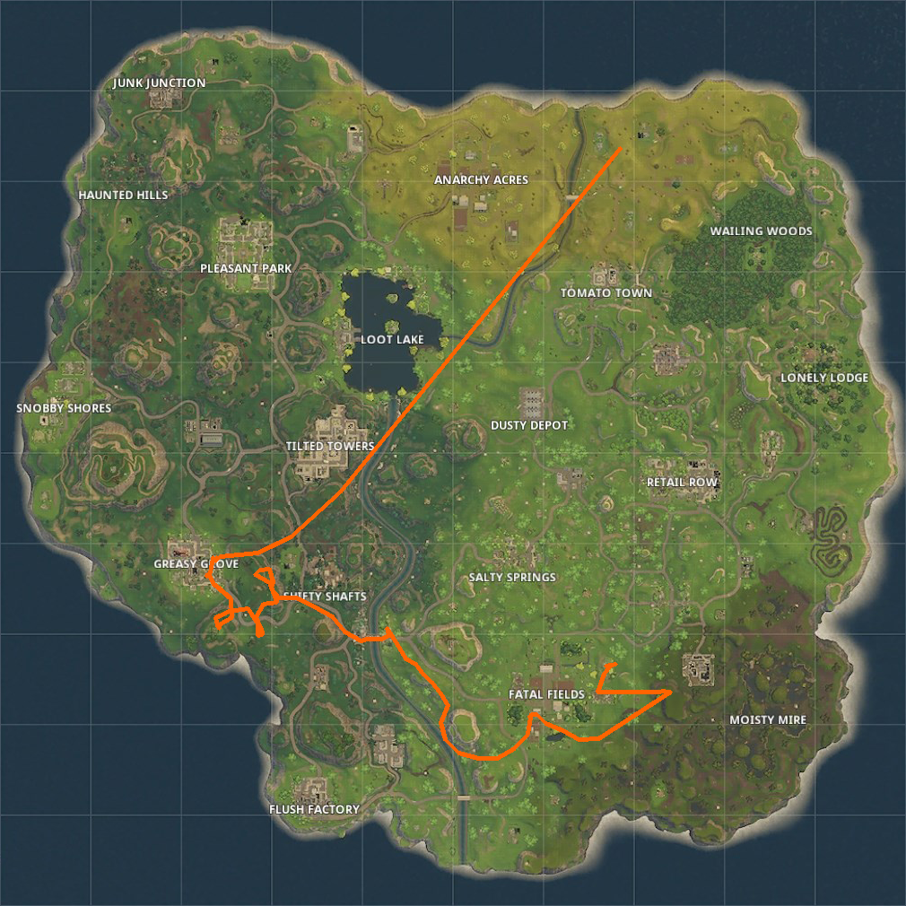
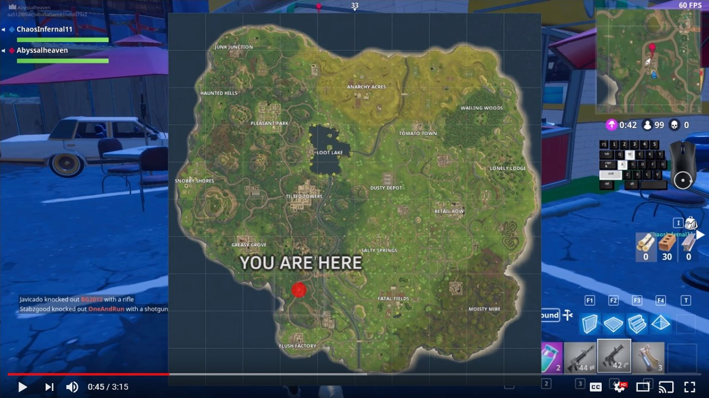
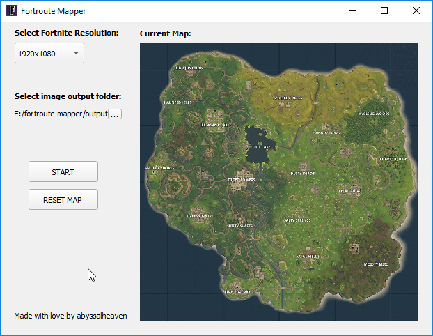

# fortroute-mapper [WIP]

[[ Currently needs testing due to changes with minimap text size. ]]

Fortmap is a python program designed to use the in-game minimap to record your location throughout a match of Fornite Battle Royale, in order to display your route through the match, for record keeping!

Fortmap uses OpenCV and the Python Imaging Library(PIL) to take screenshots of your game, and find where in the map you are based on the minimap, and track the position through the game. Recently updated for the V3.3.0 Map update.

## Explainer Video

## Installation

Currently fortmapper is only available to be run from the Python source code, though I've tried my best to make it as easy as possible to install. 

### 1. Install Python 3.6

First thing that you need to do is install Python! You can find the download at [https://www.python.org/](https://www.python.org/). I recommend downloading version 3.6 as that is what I am currently using. If you are using Windows, make sure you click the installation option to add Python to PATH. If successful, you should be able to type `python` into the command prompt and it should then say the Python version, and open up a Python shell. If you get an error that python is not a recognized command, then you may not have added Python to the system PATH properly - google the error and you'll probably find the fix quickly. Otherwise, you can type `exit()` to get back to the command prompt.

### 2. Install Pipenv

Pipenv is the package manager that this project now uses to handle the installation of all Python packages. It is the officially recommended package manager. First, however, you have to install Pipenv. To do this, open up a command prompt / terminal and type `pip install pipenv`. If you get an error that pip is not a recognized command, then google the error and you'll probably find the fix quickly.

### 3. Install the dependencies

`pipenv install` should be all you need to run. It will create what is called a virtual environment, and install all of the packages you need to run fortmapper!

## Usage

`python gui.py` 

Currently the app is initialized through the gui, so that's all you need to get up and running! It should look like the image below.

## GUI In Progress
